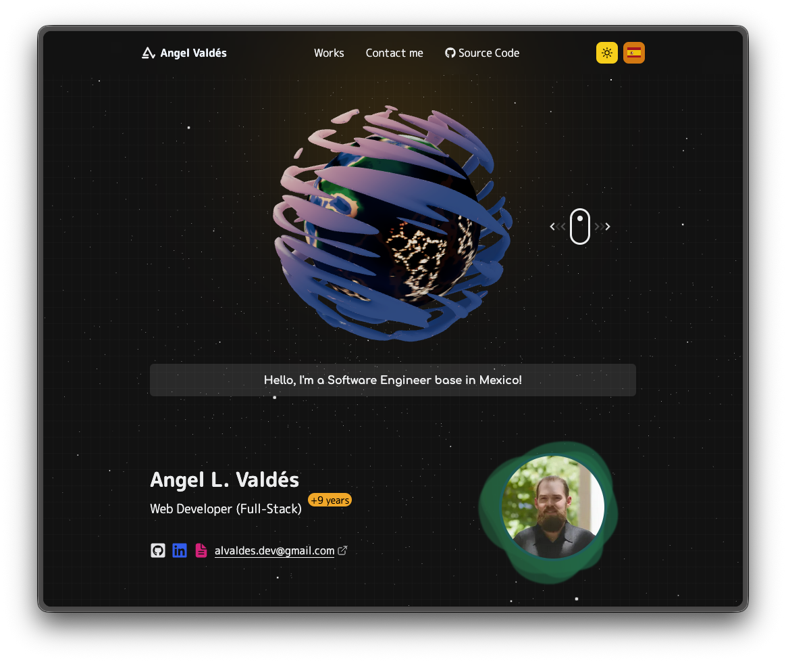

<div align="center">

<h2>
    My Personal Portfolio
</h2>


</div>

<p></p>

<div align="center">


[](#)

</div>

## 🛠️ Stack

- **[Next.js 16.1.6](https://nextjs.org/)** - React framework with App Router
- **[React 19](https://react.dev/)** - Library for user interfaces
- **[TypeScript](https://www.typescriptlang.org/)** - Typed superset of JavaScript
- **[HeroUI](https://heroui.com/)** - UI component library (latest stable)
- **[Tailwind CSS v4](https://tailwindcss.com/)** - Utility-first CSS framework
- **[React Three Fiber](https://docs.pmnd.rs/react-three-fiber)** - React renderer for Three.js
- **[Framer Motion](https://www.framer.com/motion/)** - Animation library
- **[next-themes](https://github.com/pacocoursey/next-themes)** - Theme management (dark/light)

## ✨ Features

- 🌍 **Internationalization (i18n):** Full support for English and Spanish
- 🎨 **Themes:** Dark and light mode with instant switching
- 🚀 **Modern Next.js:** Server Components, App Router, async params
- 🎭 **3D Elements:** Interactive canvas with Earth and stars
- 📱 **Responsive Design:** Mobile-first with HeroUI components
- ⚡ **Performance:** Optimized fonts, images and code splitting

## 🚀 Getting Started

### Prerequisites

- **Node.js 24.13.0** (see `.nvmrc` or `.node-version`)
- **pnpm** (recommended)

### Installation

```bash
# Clone the repository
git clone https://github.com/alvaldes/portfolio.git

# Install dependencies
pnpm install

# Start development server
pnpm dev
```

Open [http://localhost:3000/en](http://localhost:3000/en) or [http://localhost:3000/es](http://localhost:3000/es) in your browser.

## 🧞 Commands

| Command        | Action                                      |
| :------------- | :------------------------------------------ |
| `pnpm install` | Install dependencies                        |
| `pnpm dev`     | Start development server at `localhost:3000` |
| `pnpm build`   | Build the site for production in `./next`  |
| `pnpm start`   | Start production server                     |
| `pnpm lint`    | Run ESLint to check code                    |

## 📁 Project Structure

```
portfolio/
├── app/
│   └── [lang]/              # i18n routes (en/es)
│       ├── layout.tsx       # Main layout with providers
│       ├── page.tsx         # Home page
│       ├── works/           # Projects listing & detail
│       └── globals.css      # Global styles and theme config
├── dictionaries/
│   ├── en.json             # English translations
│   └── es.json             # Spanish translations
├── lib/
│   └── dictionary.ts       # i18n utility functions
├── public/
│   └── images/             # Static assets
├── .eslintrc.json          # ESLint configuration
├── .node-version           # Node version specification
├── AGENTS.md               # AI agent instructions
├── CLAUDE.md               # AI development guidelines
├── i18n.config.ts          # i18n configuration
├── next.config.js          # Next.js configuration
├── package.json            # Project dependencies and scripts
├── postcss.config.js       # PostCSS configuration
├── README.md               # This file
├── tailwind.config.ts      # Tailwind CSS configuration
└── tsconfig.json           # TypeScript configuration
```

## 🌐 Routes

| Route                 | Description                      |
| :-------------------- | :------------------------------- |
| `/en`                 | Home (English)                   |
| `/es`                 | Home (Spanish)                   |
| `/en/works`           | Projects listing (English)       |
| `/es/works`           | Projects listing (Spanish)       |
| `/en/works/[id]`      | Project detail (English)         |
| `/es/works/[id]`      | Project detail (Spanish)         |

## 🔑 License

MIT

## Show your support

Give a ⭐ if you like this website!

<a href="https://www.buymeacoffee.com/alvaldesde6"></a>
